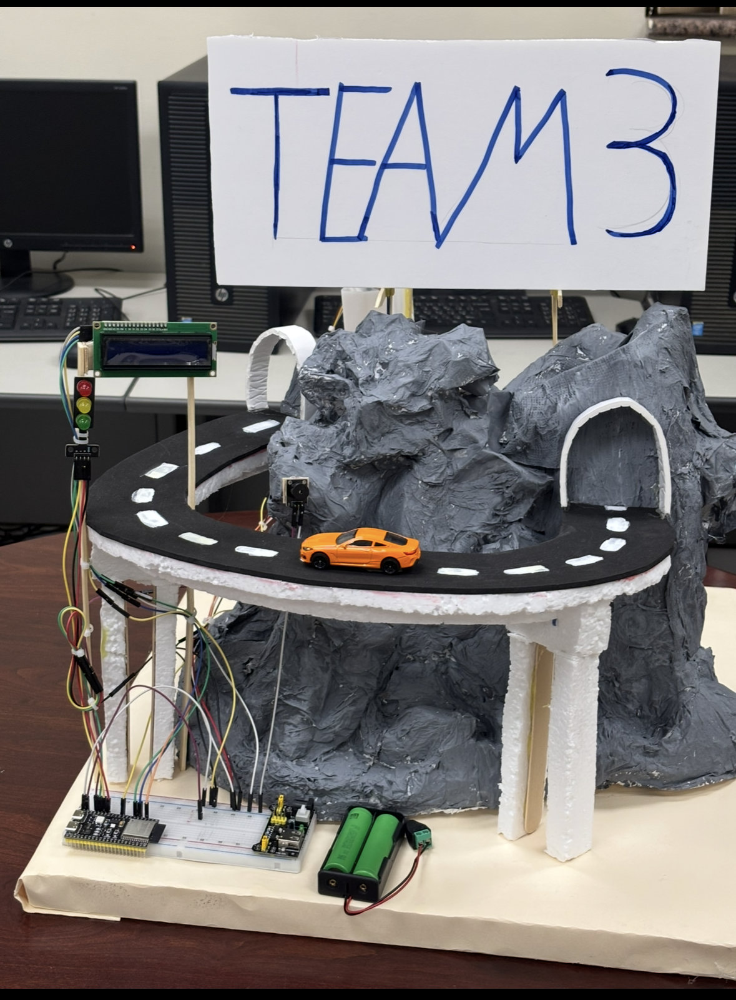

# ESP32 Smart Rain/Flood Warning System



An ESP32-based intelligent weather monitoring system that measures liquid accumulation rates to dynamically adjust hypothetical road speed limits. It uses a dual-core architecture to handle hardware sensor logic on Core 1 while seamlessly managing Wi-Fi, Telegram Bot interactions, and file system operations on Core 0.

## 🚀 Features

*   **Dual-Core Processing (FreeRTOS):** Separates time-critical sensor reading (Core 1) from network-heavy Telegram communications (Core 0).
*   **Dynamic State Management:** Automatically shifts between Normal, Mid Caution, High Alert, and Timeout states based on fill-rate timing.
*   **Telegram Bot Integration:** Sends emergency broadcast alerts and responds to user commands (`/state`, `/status`, `/getdata`).
*   **Persistent User Registration:** Saves authorized Telegram Chat IDs to the ESP32's internal flash (LittleFS) so users stay registered after a power cycle.
*   **Non-Blocking Hardware I/O:** Uses asynchronous timers (no `delay()`) to manage blinking LEDs, a piezzo buzzer sequence, and alternating LCD displays without interrupting sensor polling.

---

## 🛠 Hardware Requirements
*   **ESP32 Development Board**
*   **I2C LCD Display (16x2)**
*   **LED Traffic Light Module** (Red, Yellow, Green)
*   **Piezo Buzzer**
*   **Sensors:**
    *   Digital contact wire/probe (Start trigger)
    *   Analog water level sensor (Stop trigger)

### Pin Configuration

| Component | Pin | Notes |
| :--- | :--- | :--- |
| **Buzzer** | `GPIO 12` | PWM Output |
| **Green LED** | `GPIO 11` | Normal State |
| **Yellow LED** | `GPIO 10` | Mid Caution State |
| **Red LED** | `GPIO 9` | High Alert State |
| **LCD SDA** | `GPIO 6` | I2C Data |
| **LCD SCL** | `GPIO 7` | I2C Clock |
| **Start Sensor**| `GPIO 18` | Digital Input (Triggers at ~30% capacity) |
| **Stop Sensor** | `GPIO 4` | Analog Input (Triggers at ~70% capacity) |

---

## 💻 Software Dependencies

Ensure you have installed the following libraries in your Arduino IDE:

*   [UniversalTelegramBot](https://github.com/witnessmenow/Universal-Arduino-Telegram-Bot)
*   [ArduinoJson](https://arduinojson.org/)
*   [LiquidCrystal_I2C](https://github.com/johnrickman/LiquidCrystal_I2C)
*   Built-in ESP32 Libraries: `WiFi`, `WiFiClientSecure`, `Wire`, `LittleFS`

---

## ⚙️ Configuration & Setup

1.  **Clone the project** and open it in the Arduino IDE.
2.  **Update Network Credentials:**
```cpp
    const char *ssid = "YOUR_WIFI_SSID";
    const char *password = "YOUR_WIFI_PASSWORD";
```
3.  **Update Telegram Bot Credentials:**
    Message [@BotFather](https://t.me/botfather) on Telegram to create a bot and get a token.
```cpp
    #define BOTtoken "YOUR_TELEGRAM_BOT_TOKEN"
    const String adminChatID = "YOUR_ADMIN_CHAT_ID";
```
4.  **Upload the Code:** Ensure your Arduino IDE Partition Scheme is set to accommodate **LittleFS** (e.g., "Default 4MB with spiffs/LittleFS").

---

## 🚦 System States & Thresholds

The system measures the time it takes for water to rise from the **Start Pin** to the **Stop Pin**.

| Fill Time | State | Speed Limit | Visual/Audio Feedback |
| :--- | :--- | :--- | :--- |
| **< 10 sec** | **HIGH ALERT** | 0 km/h | Red LED, Buzzer active, Telegram Alert sent |
| **10 - 35 sec** | **MID CAUTION** | 40 km/h | Yellow LED (Blinking) |
| **> 35 sec** | **LOW TIMEOUT** | Needs Restart | Prompts to empty the cup |
| **Idle/Reset** | **NORMAL** | 80 km/h | Green LED |

*To reset the system from a High/Mid/Timeout state, the water must be drained (Analog sensor drops below `500` and digital wire is untriggered).*

---

## 📱 Telegram Commands

Send the following commands directly to your configured Telegram Bot:

| Command | Description | Authorization |
| :--- | :--- | :--- |
| `/state` | Returns the current weather/alert state. | Anyone |
| `/status` | Checks if the system is online and returns the local IP. | Anyone |
| `/getdata` | Returns a detailed Markdown diagnostic report (speeds, times, RSSI). | **Admin Only** |

*(Note: Sending any message to the bot automatically registers your Chat ID in LittleFS to receive future emergency broadcasts).*
